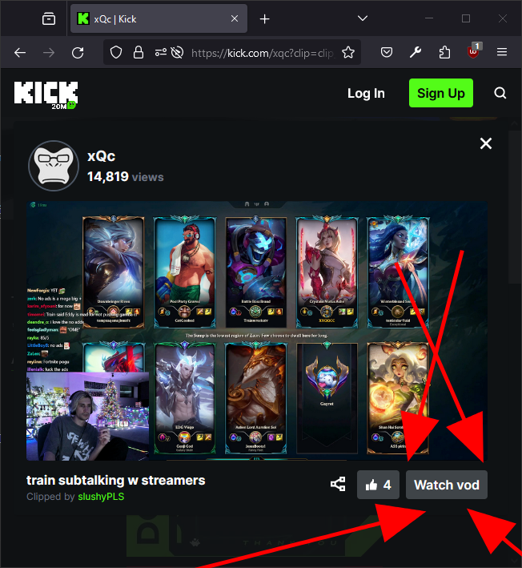

# Kick Utilities
Add watch vod button to Kick clips.



# Build from source
```
without git history:
pnpm dlx degit Kernocal/kick-utilities <folder-name>

with git history:
git clone https://github.com/Kernocal/kick-utilities.git <folder-name>

cd <folder-name>
pnpm install
pnpm run dev

For chrome:
pnpm run build

For firefox:
pnpm run build:ff
```

Then you can load unpacked using the created /build folder.